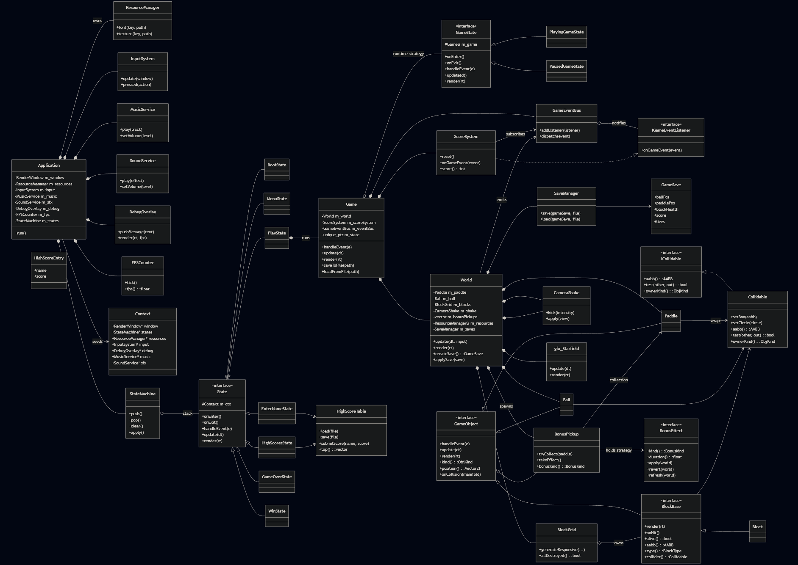

# Lord Arkanoid

**Lord Arkanoid** is a classic oldschool brick-breaker built with **C++20** and **SFML 2.6**. The project is educational demonstration, focuses on a clean separation of gameplay, rendering, audio, state management, and persistence while keeping the core loop lightweight and extensible.

---

## Contents
- [Features](#features)
- [Project Structure](#project-structure)
- [Architecture](#architecture)
  - [Core](#core)
  - [World and Entities](#world-and-entities)
  - [Systems and Flow](#systems-and-flow)
  - [Rendering and VFX](#rendering-and-vfx)
  - [Audio](#audio)
  - [Persistence and High Scores](#persistence-and-high-scores)
- [Gameplay](#gameplay)
- [Controls](#controls)
- [Bonuses](#bonuses)
- [Debugging](#debugging)
- [Roadmap](#roadmap)
- [License](#license)

---

## Features
- Modular architecture with explicit state management (`Menu`, `Play`, `Win`, `GameOver`, `HighScores`, and `EnterName`).
- Event-driven score tracking, save/load support, and a persistent high-score table.
- Multiple gameplay modifiers: **fireball**, **fragile blocks**, **random bounce**, **small paddle**, and **slow paddle** effects.
- Visuals: starfield background, RGB sparkle effects, camera shake on impacts, and bonus banners.
- Input abstraction with keyboard or mouse steering, pause handling, and a debug overlay toggle.
- Audio layer with music and sound services for decoupled playback control.

## Project Structure
```
include/
  core/    # Application, StateMachine, Resources, Scores, Events, Saves
  game/    # World, Paddle, Ball, Blocks, Bonuses, collision helpers
  states/  # Boot, Menu, Play, Win, GameOver, EnterName, HighScores
  input/   # InputSystem abstraction for keyboard/mouse
  gfx/     # Starfield, RGB effects
  vfx/     # CameraShake and visual helpers
  audio/   # MusicService, SoundService
  utils/   # FPS counter, DebugOverlay, profiler
src/       # Implementations mirroring headers
resources/ # Assets (textures, fonts, audio) copied next to the binary at build time
CMakeLists.txt
```

## Architecture
The game is organized around a thin **Application** shell that wires together input, audio, rendering, and the state machine. Gameplay lives inside a `Game` wrapper that owns the `World` and exposes save/restore hooks.

<<<<<<< HEAD
=======


>>>>>>> ae78ed2 (feat: update readme file)
### Core
- **Application** builds the render window, wires `ResourceManager`, `InputSystem`, audio services, the debug overlay, and the `StateMachine`, then runs the main loop.
- **StateMachine / State** encapsulate screen transitions. Each state (Menu, Play, Win, GameOver, HighScores, EnterName) derives from `State` and owns only the data it needs.
- **Resources** centralize loading of fonts, textures, and sounds using the compile-time `ASSETS_DIR` definition from CMake.
- **InputSystem** normalizes keyboard and mouse steering, pause events, and the debug toggle into a per-frame API.

### World and Entities
- **World** hosts the gameplay arena: `Paddle`, `Ball`, `BlockGrid`, and falling `BonusPickup` objects. It keeps the active lives counter, victory detection, and base view setup.
- **Paddle** reacts to input (keyboard or mouse) and clamps movement to the playfield.
- **Ball** manages collision-aware movement, speed scaling, piercing/random-bounce flags, and color changes tied to modifiers.
- **BlockGrid** stores destructible blocks and exposes collision queries.
- **BonusPickup / BonusEffect** implement the strategy pattern: each pickup holds a polymorphic effect that applies and reverts its modifier on activation.

### Systems and Flow
- **Collision helpers** live under `game/Collision.h` and `game/Collidable.h` to keep geometric tests isolated from entity code.
- **Bonus management** in `World` drives spawn logic, activation timers, banner messaging, and cleanup of expired effects.
- **ScoreSystem** listens to game events (block destroyed, bonus collected, life lost) via `GameEventBus` to keep score logic separate from rendering and input.
- **Save/Load hooks** through `GameSave` and `SaveManager` capture the world state (ball, paddle, blocks, lives, score) for persistence.

### Rendering and VFX
- **Starfield / TwinkleStarfield** backdrop and **RgbEffects** utilities provide layered visual depth behind the playfield.
- **CameraShake** injects temporary view offsets during impactful events (like ball-block hits) without leaking into game logic.
- **DebugOverlay** displays FPS and frame timings when toggled, helping profile performance without recompiling.

### Audio
- **MusicService** and **SoundService** wrap SFML audio, allowing states to start/stop background music or play contextual SFX without coupling to the low-level API.

### Persistence and High Scores
- **SaveManager** serializes `GameSave` snapshots to disk (default `savegame.dat`) so sessions can be resumed from the Play state.
- **HighScoreTable / HighScoreEntry** keep leaderboard data, with `EnterNameState` collecting the player name after a winning run.

## Gameplay
- Break all blocks to win the level; letting the ball fall below the paddle costs a life.
- Lives are tracked by `World`, which also stores a memento-like save right before life loss to allow recovery flows.
- Victory and defeat trigger dedicated states that route back to the menu or the high-score name entry.

## Controls
- **Move paddle**: `Left` / `Right` arrows or mouse movement (switches control mode on the fly).
- **Pause / back to menu**: `Esc` during play.
- **Debug overlay**: `F3` toggles the performance overlay.
- **Quick Save**: `F5` makes quick save during play.
- **Quick Load**: `F9` makes quick load during play.


## Bonuses
Each falling pickup grants a timed modifier when caught by the paddle:
- **FireBall** – piercing shots that pass through blocks with a speed boost.
- **FragileBlocks** – makes bricks easier to destroy.
- **RandomBounce** – adds unpredictability to reflections.
- **SmallPaddle** – temporarily shrinks the paddle width.
- **SlowPaddle** – reduces paddle speed for finer control.

Active effects can stack in the `World`, and reapplying a pickup refreshes its timer.

## Debugging
- Toggle the **debug overlay** with `F3` to inspect FPS and frame timings.
- The `InputSystem` exposes a per-frame `newFrame()` to reset edge-triggered inputs, keeping event handling deterministic.

## Roadmap
- Additional block layouts and themed levels.
- Expanded bonus pool with negative effects and multi-ball variants.
- Soundtrack expansion and per-event SFX layering.
- Automated gameplay tests for collision and scoring edge cases.

## License
This project is distributed under the terms of the [MIT License](LICENSE).

###  Author
Lord Arkanoid — is an educational demonstration project focused on clear architecture, performance and pattern designs. Author: Kuzmenko Pavel